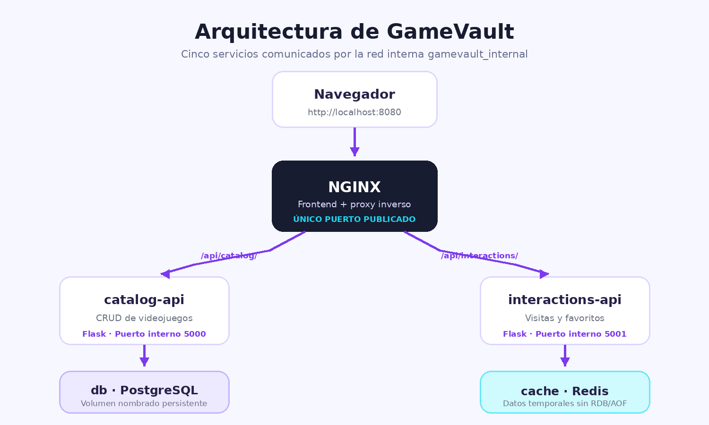
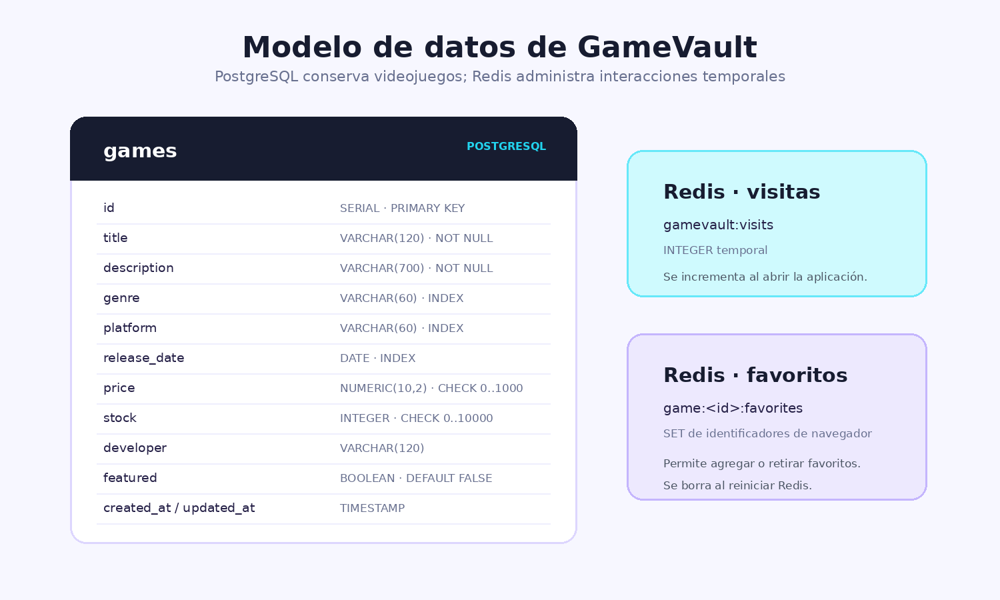

# GameVault

**Catálogo de videojuegos con Docker Compose**

GameVault permite registrar, consultar, editar, eliminar, buscar y filtrar videojuegos. También registra visitas y favoritos temporales. El proyecto fue creado para el Laboratorio Docker del segundo parcial de Redes II.

El paquete incluye un [manual visual de instalación, pruebas y defensa](docs/Manual_GameVault.pdf) listo para consultar o imprimir.

## Integrantes

- Denilson Yair Díaz López - Carné 202308106
- Jose Raúl Soto Cal - Carné 202308084
- Diego Alejandro Xicara Santizo - Carné 202408048


> Complete los nombres pendientes antes de entregar si el proyecto se presenta en equipo.

## Características

- CRUD completo de videojuegos.
- Búsqueda por título, descripción o desarrollador.
- Filtros por género, plataforma y estado: nuevo, clásico o próximamente.
- Videojuego destacado como característica distintiva.
- Información de lanzamiento, plataforma, desarrollador, precio y existencias.
- Favoritos por navegador y contador general de visitas mediante Redis.
- Validaciones en el formulario y en la API.
- Mensajes comprensibles cuando una entrada es inválida o un servicio no responde.
- Diseño responsive para computadora, tableta y teléfono.

## Arquitectura

La solución contiene exactamente cinco servicios. Solo NGINX publica un puerto al host.

| Servicio | Imagen | Función | Puerto publicado |
|---|---|---|---|
| `nginx` | Imagen propia | Interfaz web y proxy inverso | `${APP_PORT}:80` |
| `catalog-api` | Imagen propia | CRUD y reglas de negocio | Ninguno |
| `interactions-api` | Imagen propia | Visitas y favoritos | Ninguno |
| `db` | `postgres:16-alpine` | Datos permanentes | Ninguno |
| `cache` | `redis:7-alpine` | Datos temporales | Ninguno |



Todos los servicios pertenecen a la red `gamevault_internal`. Las API usan los nombres `db` y `cache` para comunicarse internamente.

## Modelo de datos

PostgreSQL conserva la tabla `games` en el volumen nombrado `gamevault_postgres_data`.



Redis usa estas claves temporales:

- `gamevault:visits`: contador global de visitas.
- `gamevault:game:<id>:favorites`: conjunto de navegadores que marcaron un videojuego.

## Requisitos previos

- Windows 10/11, Linux o macOS.
- Docker Desktop o Docker Engine activo.
- Docker Compose v2 (`docker compose`).
- Conexión a Internet durante la primera construcción.
- Puertos disponibles: el valor configurado en `APP_PORT`, por defecto `8080`.

## Instalación desde cero

### Windows PowerShell

Ejecute un comando a la vez dentro de la carpeta descomprimida:

```powershell
Copy-Item .env.example .env
```

```powershell
docker compose config
```

```powershell
docker compose up -d --build
```

```powershell
docker compose ps
```

Abra en el navegador:

```text
http://localhost:8080
```

### Linux o macOS

```bash
cp .env.example .env
docker compose config
docker compose up -d --build
docker compose ps
```

Luego abra `http://localhost:8080`.

## Variables de entorno

| Variable | Ejemplo | Uso |
|---|---|---|
| `APP_PORT` | `8080` | Puerto público de NGINX |
| `APP_ENV` | `production` | Entorno de ejecución |
| `POSTGRES_DB` | `gamevault` | Nombre de la base |
| `POSTGRES_USER` | `gamevault_user` | Usuario de PostgreSQL |
| `POSTGRES_PASSWORD` | `CambieEstaClave2026` | Contraseña de PostgreSQL |
| `DB_PORT` | `5432` | Puerto interno de PostgreSQL |
| `CATALOG_API_PORT` | `5000` | Puerto interno del CRUD |
| `INTERACTIONS_API_PORT` | `5001` | Puerto interno de interacciones |
| `REDIS_PORT` | `6379` | Puerto interno de Redis |

Cambie la contraseña antes de usar el proyecto fuera del laboratorio. El archivo `.env` no debe subirse a un repositorio público.

## Rutas de la API

El navegador entra siempre por NGINX.

### Catálogo

| Método | Ruta pública | Función |
|---|---|---|
| GET | `/api/catalog/health` | Estado de la API y PostgreSQL |
| GET | `/api/catalog/games` | Listar y filtrar videojuegos |
| GET | `/api/catalog/games/options` | Listar géneros y plataformas |
| GET | `/api/catalog/games/:id` | Consultar un videojuego |
| POST | `/api/catalog/games` | Crear un videojuego |
| PUT | `/api/catalog/games/:id` | Editar un videojuego |
| DELETE | `/api/catalog/games/:id` | Eliminar un videojuego |

Parámetros disponibles en `GET /games`: `q`, `genre`, `platform`, `status` y `featured`.

### Interacciones

| Método | Ruta pública | Función |
|---|---|---|
| GET | `/api/interactions/health` | Estado de la API y Redis |
| POST | `/api/interactions/visits` | Incrementar visitas |
| GET | `/api/interactions/stats` | Consultar visitas y favoritos |
| GET | `/api/interactions/games/favorites` | Cantidad de favoritos por videojuego |
| GET | `/api/interactions/games/:id/favorite` | Estado del favorito del navegador |
| POST | `/api/interactions/games/:id/favorite` | Activar o retirar favorito |

## Comandos de administración

Estado de los cinco servicios:

```powershell
docker compose ps
```

Registros generales:

```powershell
docker compose logs --tail 100
```

Registros de una API:

```powershell
docker compose logs catalog-api
```

Reiniciar todos los servicios:

```powershell
docker compose restart
```

Detener sin borrar datos:

```powershell
docker compose down
```

Eliminar también el volumen de PostgreSQL y reiniciar completamente:

```powershell
docker compose down -v
```

> Use `down -v` únicamente cuando desee borrar la base de datos del laboratorio.

## Procedimiento de verificación

La guía completa está en [docs/pruebas-tecnicas.md](docs/pruebas-tecnicas.md). Resumen:

1. Ejecute `docker compose up -d --build`.
2. Compruebe los cinco servicios con `docker compose ps`.
3. Abra `http://localhost:8080`.
4. Cree un videojuego desde el formulario.
5. Búsquelo, edítelo y elimínelo.
6. Cree otro videojuego para la prueba de persistencia.
7. Ejecute `docker compose down` y luego `docker compose up -d`.
8. Compruebe que el videojuego sigue almacenado.
9. Marque un favorito y observe el contador.
10. Ejecute `docker compose restart cache` y recargue la página.
11. Compruebe que visitas y favoritos regresaron a cero.
12. Ejecute `Test-NetConnection localhost -Port 5432` y `-Port 6379`; ambos deben mostrar `TcpTestSucceeded: False`.

## Persistencia

PostgreSQL utiliza el volumen `gamevault_postgres_data`; por ello los videojuegos sobreviven a `docker compose down`, `restart` y a la recreación de contenedores. El volumen solo se elimina con `docker compose down -v`.

Redis se inicia con `--save "" --appendonly no`. Esta decisión desactiva RDB y AOF porque visitas y favoritos son datos temporales. Al reiniciar `cache`, esos contadores se pierden de manera controlada, tal como solicita la prueba del laboratorio.

## Aislamiento

En `docker-compose.yml`, `catalog-api`, `interactions-api`, `db` y `cache` utilizan `expose`, no `ports`. Esto permite la comunicación interna, pero no publica sus puertos en Windows. NGINX es el único punto de entrada.

## Errores frecuentes

### No se puede conectar al motor de Docker

Abra Docker Desktop, espere a que indique **Engine running** y repita el comando.

### El puerto 8080 está ocupado

Cambie en `.env`:

```env
APP_PORT=8085
```

Luego ejecute `docker compose up -d` y abra `http://localhost:8085`.

### La base no inicia después de cambiar credenciales

Las variables de la imagen PostgreSQL solo se aplican al crear el volumen por primera vez. Para reiniciar los datos del laboratorio:

```powershell
docker compose down -v
docker compose up -d --build
```

### NGINX responde 503

Revise el estado y los registros:

```powershell
docker compose ps
docker compose logs catalog-api interactions-api
```

### Los favoritos desaparecieron

Es el comportamiento esperado después de reiniciar Redis. Son datos temporales y su persistencia se desactivó de manera intencional.

## Estructura

```text
GameVault_Docker_Lab/
├── docker-compose.yml
├── .env.example
├── .dockerignore
├── README.md
├── nginx/
├── catalog-api/
├── interactions-api/
├── db/
├── frontend/
├── docs/
├── scripts/
└── evidencias/pruebas/
```

## Material para entrega y defensa

- `docs/guion-video.md`: guion de demostración de 6 a 10 minutos.
- `docs/guia-defensa.md`: explicación técnica y preguntas probables.
- `docs/uso-ia.md`: registro solicitado sobre asistencia con IA.
- `docs/pruebas-tecnicas.md`: pasos y capturas necesarias.
- `evidencias/pruebas/README.md`: nombres sugeridos para las capturas.
- `scripts/probar-proyecto.ps1`: pruebas rápidas desde PowerShell.

## Autoría

Proyecto académico personalizado para Redes II, Universidad Mesoamericana, sede Quetzaltenango.
